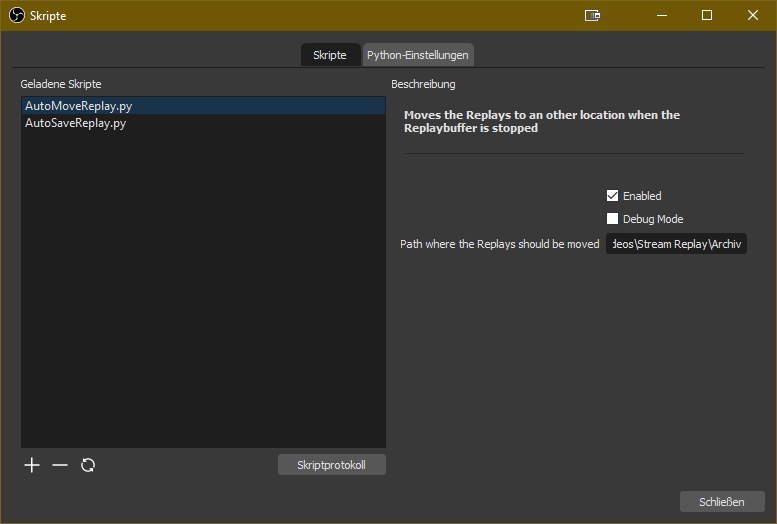
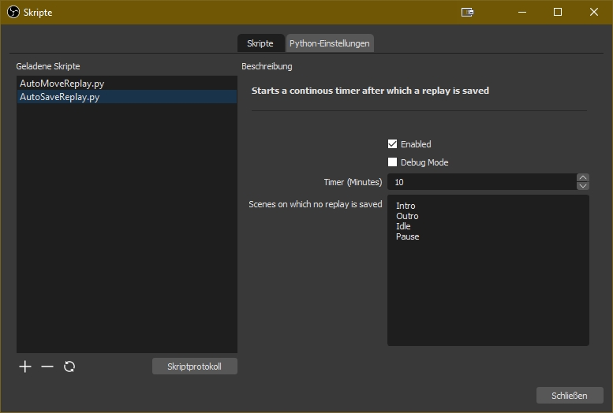

# OBS-Skripte
Skripte für OBS Streaming Software

# AutoMoveReplay.py
Move saved replays when the replay buffer is stopped.

# AutoSaveReplay.py
Starts a continous timer after which a replay is saved.

<!--stackedit_data:
eyJoaXN0b3J5IjpbLTExNjI1Nzc0NjFdfQ==
-->