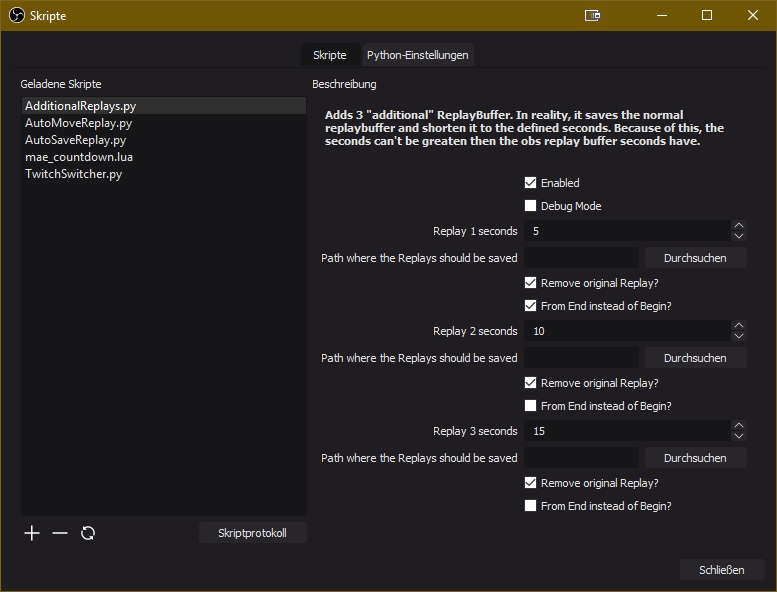
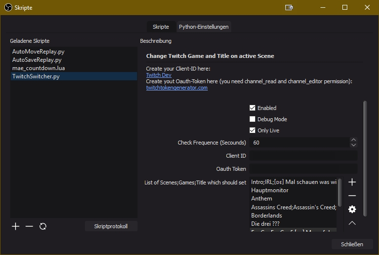

# OBS-Skripte
Skripte für OBS Streaming Software

 - [AdditionalReplays.py](#additionalreplayspy) - This project is abandoned
 - [AutoMoveReplay.py](#automovereplaypy)
 - [AutoSaveReplay.py](#autosavereplaypy)
 - [TwitchSwitcher.py](#twitchswitcherpy) - This project is abandoned

# AdditionalReplays.py - This project is abandoned
Add 3 additional Replay buffer. In reality, it saves the normal replaybuffer and clip the seconds from begin or end.  

# AutoMoveReplay.py
Move saved replays when the replay buffer is stopped.  

# AutoSaveReplay.py
Starts a continous timer after which a replay is saved.  

# TwitchSwitcher.py - This project is abandoned
Change Twitch Game and Title based on active Scene.  

## Problems?
 - [here](http://discord.bootscreen.net) on my Discord

## Support
You can support me on:
 - [here](http://twitch.bootscreen.net) on Twitch
 - [here](http://donation.bootscreen.net) on Streamlabs

<!--stackedit_data:
eyJoaXN0b3J5IjpbLTE1NjUwNzIyNjcsLTc3MDQyNjM5LC0xMT
YyNTc3NDYxLDEyNjk4MzU3MDEsLTExNjI1Nzc0NjFdfQ==
-->
